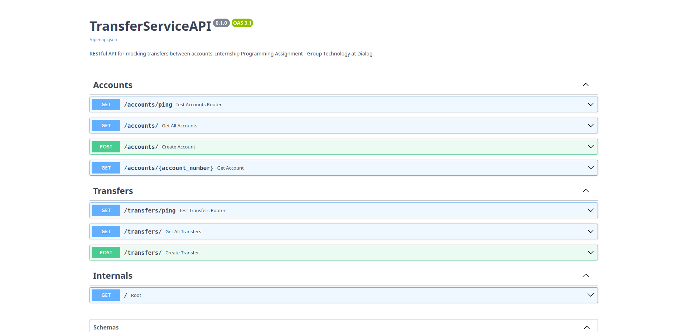

# TransferServiceAPI - Setup

TransferServiceAPI has very few prerequisites, which are probably already installed on your system:

1. [Git](https://git-scm.com/) version control system (needed to clone the project)
2. [Python](https://www.python.org/) (recommended to have a version greater than 3.9.0)

To run TransferServiceAPI locally on your machine, follow these steps:

## 1. Clone Project

Clone the project to a desired location (folder) on your machine by opening up a terminal from the folder and entering the following command:

```shell
git clone https://github.com/ravi-aratchige/TransferServiceAPI.git
```

Next, move into the `TransferServiceAPI` project directory:

```shell
cd TransferServiceAPI
```

## 2. Activate Virtual Environment

A virtual environment will help you keep TranferServiceAPI's dependencies isolated from the global system of Python packages. To setup your virtual environment, first ensure that `virtualenv` is installed on your system:

```shell
pip install virtualenv
```

To create and activate a virtual environment, enter the following commands after moving into the `TransferServiceAPI` folder as done in the previous step:

```shell
# Create a virtual environment named 'env':
python -m venv env

# Activate the virtual environment (Windows):
env\Scripts\activate.bat

# Activate the virtual environment (MacOS / Linux):
source env/bin/activate
```

Your terminal will now include an `(env)` prefix, indicating a successful activation of the virtual environment:

```shell
# On Windows:
(env) drive:\folder\...TransferServiceAPI>

# On MacOS and Linux
(env) user@computer:~/...TransferServiceAPI$
```

To deactivate the virtual environment (and remove the `(env)` prefix):

```shell
deactivate
```

## 3. Install Dependencies

After activating the virtual environment, you can install the necessary dependencies:

```shell
pip install -r requirements.txt
```

[`requirements.txt`](https://github.com/ravi-aratchige/TransferServiceAPI/blob/main/requirements.txt) includes all of the project's dependencies and their respective versions.

### 4. Start FastAPI App

Start up the FastAPI server:

```shell
fastapi dev main.py
```

FastAPI will then serve TransferServiceAPI on [http://localhost:8000](http://localhost:8000). Navigate to [http://localhost:8000/docs](http://localhost:8000/docs) to view the SwaggerUI for TransferServiceAPI:



---

Made with ❤️ by Ravindu Aratchige